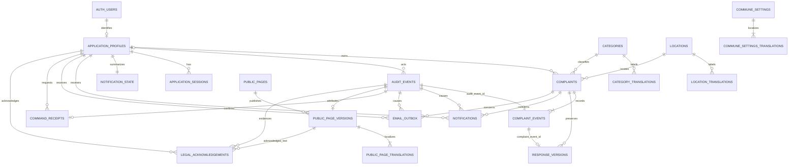

# Abaynou Tatawasal — Database Data Model

## 1. Document control and authority

| Field | Value |
| --- | --- |
| Project | Abaynou Tatawasal — أباينو تتواصل; Commune of Abaynou, Morocco |
| Phase | Step 6B — Database Data Model |
| Status | **APPROVED / FROZEN** |
| Nature | Logical model and implementation requirements only; nothing implemented |
| Governing documents | [Scope](01-mvp-scope.md), [Functional Specification](02-functional-specification.md), [Lifecycle](03-complaint-lifecycle.md), [Roles / Permissions / Security](04-roles-permissions-security.md), [Technical Architecture](05-technical-architecture.md), [Database Architecture — Step 6A](06-database-architecture.md) |

The six frozen documents, including Step-3 LC-AMEND-001, govern this logical-model baseline. Explicit later amendments override historical wording about assignment or previously pending decisions. Written approvals override screenshots. Existing screen needs are covered through the frozen specifications; no screenshot is treated as authority to restore a removed feature. No frozen document is changed.

**Approval note:** Step 6B — Database Data Model is now the authoritative logical database-model baseline for the Abaynou Tatawasal MVP. DBM-01 through DBM-12 are **APPROVED / FROZEN**; OQ-01 is **CLOSED / APPROVED**; Q-17 is **RESOLVED by LC-AMEND-001**. Final source-consistency review found no new material model contradiction or blocker, and no genuine Step-6B project-owner decision remains.

Future logical-model changes require explicit project-owner approval and change control, consistent with frozen Steps 1–6A and their approved amendments. This freeze does not authorize database implementation or the next development step; implementation planning must be separately authorized. No SQL, physical schema, tables, migrations, policies, functions, triggers, seeds, Supabase project/configuration, TypeScript types, persistence adapters or application code are created by this document.

## 2. Principles and conventions

- Supabase Auth supplies identity and credential lifecycle. The application owns profiles, roles, access status, sessions, complaints and durable business history.
- Exactly three application roles: `CITIZEN`, `AGENT`, `ADMIN`. All authorized Agents share all complaints. There is no assignment, claiming, department ownership, or routine Technical Administrator application role.
- Trusted server commands enforce business rules; restricted database access and RLS provide complementary protection. No browser-supplied actor/role is trusted.
- Normalize current reference/configuration data. Use narrowly defined historical snapshots only where a mutable source cannot preserve the submitted facts.
- Keep current complaint state for operational queries and append-only events for accountability. This is not a general event-sourcing architecture.
- No normal hard-delete operation for complaints, issued responses, business history or historically referenced identities. Do not add generic soft-delete fields everywhere.
- No attachments, storage buckets, chat, clarification, internal notes, assignment, statistics/analytics, SLA, surveys, or advanced departmental entities. No durable complaint or response drafts.

### 2.1 Field dictionary

Logical types, not DDL: `UUID`, `TEXT`, `BOOLEAN`, `INTEGER`, `REVISION` (positive, non-wrapping integer), `CODE` (controlled text), `TIME` (TIMESTAMP WITH TIME ZONE, UTC instant), `JSON` (strictly defined object), `DIGEST` (non-reversible secret/fingerprint digest).

Field tables give requiredness, defaults, uniqueness and constraints together. `R` means required; `O` optional/null. No default exists unless stated. `PK` and `FK` mean primary and foreign key requirements, not implemented keys. Unless a composite key is specified, `id` is a server-generated random UUID, required, unique, immutable. Timestamps come from trusted server/database time, not the browser. `revision` starts at 1 and increments on every meaningful mutation of its aggregate. All FK relationships are required unless marked O.

Privacy: `P` personal/linkable data; `S` potentially sensitive free text; `R` restricted security/operational data; `N` intended non-personal/public domain data. Identifiers that link people to complaints remain personal data even when random. Public content must not contain Citizen data. Nothing classified N makes its administrative metadata public.

Names: plural snake_case entities, singular `_id` references, `_at` instants, `is_` booleans, uppercase language-neutral domain codes, lowercase `ar/fr/en`. No display label serves as a technical identifier.

### 2.2 Logical schema and identifier recommendations

Use one application schema, provisionally `app`, alongside provider-managed `auth`. Do not put application tables in `auth`. A single non-exposed application schema simplifies grants and avoids accidental Data API exposure; extra business/security schemas are unnecessary for this MVP. A carefully secured public schema would also work but provides less explicit separation. Schema placement is not an authorization mechanism.

Use application UUIDs independently of `auth.users.id`; keep a unique mapping in profiles. This slightly increases linkage work but allows an identity-provider migration without changing complaint owners and historical actors.

Complaint reference proposal: `AB-` plus 12 random uppercase characters from an unambiguous alphabet, grouped for readability. Enforce uniqueness and retry a collision before committing; never regenerate after submission. It conveys no email/name/location and is not an access credential. Sequential/yearly numbers are an alternative, but expose activity volume and require an unnecessary numbering policy. This format direction is APPROVED / FROZEN under DBM-02.

## 3. Entity inventory — APPROVED / FROZEN

Twenty application entities; provider-managed `auth.users` is an external dependency, not a twenty-first application entity. Translation rows, security support and outbox records are persistence support, not extra user-facing features.

| # | Entity | Purpose / classification | Ownership | Personal data? | Mutation / deletion rule |
| --- | --- | --- | --- | --- | --- |
| 1 | application_profiles | Identity/profile; application identity, role and access status | Person; administratively governed by Commune | Yes | Limited updates; disable, never ordinary delete |
| 2 | categories | Reference/configuration catalogue | Commune | No, excluding linked audit | Edit/deactivate; retain referenced rows |
| 3 | category_translations | Reference/configuration labels | Commune | No | Edit through category aggregate; no normal delete |
| 4 | locations | Reference/configuration douars | Commune | No, excluding linked audit | Edit/deactivate; retain referenced rows |
| 5 | location_translations | Reference/configuration labels | Commune | No | Edit through location aggregate; no normal delete |
| 6 | complaints | Core transactional submission/current state | Citizen owner; Commune processing | Yes, sensitive | Guarded updates; never ordinary delete |
| 7 | complaint_events | Audit/history; Citizen-visible business history source | Complaint | Yes, sensitive | Append-only; never ordinary delete |
| 8 | response_versions | Core transactional/history; issued response and corrections | Complaint; Commune authored | Yes, sensitive | Append-only; never ordinary delete |
| 9 | audit_events | Audit/history; attributable administrative/security actions | Commune restricted governance | Yes | Append-only; no ordinary alteration/deletion |
| 10 | application_sessions | Security/session enforcement | Account | Yes, restricted | Server updates/revokes; controlled expiry cleanup only under policy |
| 11 | notifications | Notification record | Recipient | Yes | Only read timestamp mutable; policy-based future cleanup |
| 12 | notification_state | Notification polling/change marker | Recipient | Yes | Server-maintained mutable summary, no normal delete |
| 13 | email_outbox | Notification; reliable application-email delivery intent | Event/recipient | Yes, restricted | Delivery metadata mutable; future controlled retention |
| 14 | command_receipts | Security/session; mutation retry deduplication | Actor/command | Yes, restricted | Append committed results; future controlled retention |
| 15 | public_pages | Public content; fixed page identity/current publication | Commune | No, excluding linked audit | Current pointer/revision mutable; no CMS page creation/deletion |
| 16 | public_page_versions | Public content; immutable publication bundles | Page | No, excluding linked audit | Append-only; retain referenced/acknowledged versions |
| 17 | public_page_translations | Public content; localized published copy | Publication version | No | Immutable with version |
| 18 | legal_acknowledgements | Audit/history; signup acknowledgment evidence | Citizen | Yes | Append-only, no ordinary delete |
| 19 | commune_settings | Reference/configuration; typed public operational settings | Commune | No, excluding linked audit | Guarded updates; singleton, no normal delete |
| 20 | commune_settings_translations | Reference/configuration; localized public settings | Commune | No | Edit through settings aggregate; no normal delete |

## 4. Detailed entity definitions

The shared conventions in section 2 apply to every field below. Aggregate child writes also increment the parent revision. Do not silently grant direct field updates merely because an entity is mutable.

### 4.1 application_profiles

One profile serves Citizen or staff; separate Citizen/staff tables would repeat almost every field. One controlled role per account, not role arrays or a permission editor.

| Field | Purpose / type | Required, defaults and constraints | Privacy |
| --- | --- | --- | --- |
| id | Stable application identity / UUID | R; PK | P |
| auth_user_id | Provider identity / UUID | R; unique FK to auth.users.id; deletion restricted | P/R |
| full_name | Approved identity/display name / TEXT | R; nonblank; bounded validation to be fixed before implementation, not a new identity field | P |
| contact_phone | Optional contact only / TEXT | O; bounded/validated international/local format; never login or unique identity | P |
| preferred_language | Rendering preference / CODE | R; ar/fr/en; default explicit signup locale, ar fallback | P |
| role | Application authority / CODE | R; CITIZEN/AGENT/ADMIN; public signup can create only CITIZEN | R |
| access_status | Application availability / CODE | R; ACTIVE/DISABLED; activated only by trusted provisioning | R |
| security_epoch | Invalidate old sessions / REVISION | R; default 1; increase on all-session revocation/security change | R |
| created_at | Provisioning instant / TIME | R; trusted creation time | P |
| updated_at | Last profile/authority change / TIME | R; initially created_at | P |
| revision | Stale-update guard / REVISION | R; default 1 | R |

No email/password/token/verification flag duplicated here. Read the current verified email through a narrowly restricted server identity projection/provider adapter, not a raw Auth row exposed to clients. For staff complaint lists/details, use a bounded batch lookup, not an Auth API request per complaint. Optional phone is application data, not Auth phone login.

Effective Citizen usability = ACTIVE profile + confirmed provider email + valid application session. `UNVERIFIED` is a derived account state, not a second potentially inconsistent verification flag. Missing profile, unverified email or incomplete signup evidence fails closed. Staff provisioning is administrative only. An Auth identity without a complete application profile has no application role/access.

### 4.2 categories and 4.3 category_translations

| Entity.field | Purpose / type | Required, defaults and constraints | Privacy |
| --- | --- | --- | --- |
| categories.id | Canonical identity / UUID | R; PK | N |
| categories.code | Stable machine code / TEXT | R; unique; immutable, nonlocalized | N |
| categories.is_active | Selectability / BOOLEAN | R; explicitly supplied by Admin; no accidental activation default | N |
| categories.created_at | Creation / TIME | R; trusted now | N |
| categories.updated_at | Aggregate change / TIME | R; initially created_at | N |
| categories.revision | Includes label changes / REVISION | R; 1 initially | R |
| category_translations.category_id | Parent / UUID | R; FK categories; composite PK with language | N |
| category_translations.language | Label locale / CODE | R; ar/fr/en; unique per category | N |
| category_translations.label | Approved display name / TEXT | R; nonblank; bounded text | N |

No arbitrary display-order feature is added. Sort approved labels in the selected locale with code/id tie-breaker; add ordering only if subsequently required. Catalogue additions/edits are audited. New selection must be active; existing records keep inactive references.

### 4.4 locations and 4.5 location_translations

| Entity.field | Purpose / type | Required, defaults and constraints | Privacy |
| --- | --- | --- | --- |
| locations.id | Canonical identity / UUID | R; PK | N |
| locations.code | Stable nonlocalized identity code / TEXT | R; unique, immutable; not Arabic text as identifier | N |
| locations.is_active | Selectability / BOOLEAN | R; explicitly supplied by Admin | N |
| locations.created_at | Creation / TIME | R; trusted now | N |
| locations.updated_at | Aggregate change / TIME | R; initially created_at | N |
| locations.revision | Includes label changes / REVISION | R; 1 initially | R |
| location_translations.location_id | Parent / UUID | R; FK locations; composite PK with language | N |
| location_translations.language | Locale / CODE | R; ar/fr/en; unique per location | N |
| location_translations.label | Approved name / TEXT | R; nonblank; bounded text | N |

### 4.6 complaints

| Field | Purpose / type | Required, defaults and constraints | Privacy |
| --- | --- | --- | --- |
| id | Internal identity / UUID | R; PK | P |
| reference | Human-facing reference / TEXT | R; unique, immutable; section 2.2 | P |
| citizen_id | Owner / UUID | R; FK application_profiles; Citizen at creation; immutable | P |
| category_id | Canonical category / UUID | R; FK categories; selection active when newly selected | P |
| category_labels_snapshot | Historical approved labels / JSON | R; only ar/fr/en nonblank string keys actually approved; ar required for readiness; bounded object | P |
| location_id | Canonical douar / UUID | R; FK locations; selection active when newly selected | P |
| location_labels_snapshot | Historical approved labels / JSON | R; same shape as category snapshot | P |
| subject | Citizen title / TEXT | R; nonblank, max 150 characters | S |
| description | Citizen facts / TEXT | R; 20–2000 characters; not whitespace-only | S |
| location_clarification | Optional landmark/details / TEXT | O; max 300 characters; empty input treated as null | S |
| status | Current lifecycle / CODE | R; initial SUBMITTED only; exact section 7 values | P |
| not_accepted_reason | Exceptional reason / CODE | O; required iff NOT_ACCEPTED; OUT_OF_SCOPE or INSUFFICIENT_INFORMATION | S |
| submitted_at | Submission/creation instant / TIME | R; immutable trusted now; no redundant created_at | P |
| updated_at | Latest meaningful complaint action / TIME | R; initially submitted_at | P |
| status_changed_at | Latest transition instant / TIME | R; initially submitted_at | P |
| closed_at | Normal closure instant / TIME | O; present iff CLOSED; immutable; not used for other terminal states | P |
| revision | Whole complaint aggregate concurrency / REVISION | R; 1 initially; increment on edit/transition/issued correction | R |

No submitted draft row. Current response is the highest committed response version for this complaint; no circular current-response pointer required. Terminal timestamp for withdrawal/nonacceptance is status_changed_at and the immutable transition event. Status counters query current rows, not history replays.

Snapshots intentionally duplicate only approved labels, not entire reference rows. Rename/deactivation never rewrites them. An allowed Citizen change of category/location creates new snapshots and preserves previous IDs/snapshots in the edit event. Unchanged selection keeps its snapshot even if the catalogue was renamed meanwhile. Retain inactive selections for an unrelated text edit; prohibit selecting a different inactive value. Label corrections in the catalogue do not silently rewrite complaint history.

### 4.7 complaint_events

| Field | Purpose / type | Required, defaults and constraints | Privacy |
| --- | --- | --- | --- |
| id | Independent business event identity / UUID | R; PK; not reused from audit_events | P |
| audit_event_id | Audit attribution / UUID | R; UNIQUE FK audit_events.id; exactly one audit event per complaint event | P |
| complaint_id | Parent / UUID | R; FK complaints | P |
| complaint_revision | Resulting aggregate revision / REVISION | R; unique with complaint_id; contiguous committed complaint mutations | R |
| event_type | Timeline action / CODE | R; SUBMITTED/EDITED/STATE_CHANGED/RESPONSE_ISSUED/RESPONSE_CORRECTED | P |
| previous_status | Before state / CODE | O only for initial submission | P |
| new_status | After state / CODE | R; equals previous for nontransition event | P |
| edit_delta | Changed Citizen fields only / JSON | O; required only EDITED; whitelist old/new subject, description, location clarification, reference IDs and snapshots | S |

Actor, timestamp and required administrative reason are referenced through audit_event_id, not recopied. Citizen-visible projection exposes business action/time and approved explanations, not internal actor identifiers/security metadata. An issued/corrected response version has its own identity and references this event through complaint_event_id. Initial submission and edit deltas allow reconstruction of submitted facts without duplicating full complaint text at every transition. A correction reason is auditable, not an internal-note feature.

### 4.8 response_versions

| Field | Purpose / type | Required, defaults and constraints | Privacy |
| --- | --- | --- | --- |
| id | Independent response-version identity / UUID | R; PK; not reused from complaint_events or audit_events | P |
| complaint_event_id | Issuance/correction event / UUID | R; UNIQUE FK complaint_events.id; exactly one complaint event per version | P |
| complaint_id | Complaint / UUID | R; FK complaints; must match event parent | P |
| version_number | Issuance order / INTEGER | R; starts 1; unique with complaint_id; increases by 1 under complaint guard | R |
| response_kind | Normal or exceptional explanation / CODE | R; NORMAL or NOT_ACCEPTED; unchanged across versions | P |
| body | Issued Citizen-facing response / TEXT | R; nonblank, max 2000 characters | S |
| correction_reason | Reason for amendment / TEXT | O for version 1; mandatory nonblank for every later version | S |

Issued time/author come through response_versions.complaint_event_id → complaint_events.audit_event_id → audit_events.id. No response_versions.audit_event_id or duplicated actor/time is required. Version 1 is original; the largest version_number is effective. No separate response header is needed because there is only one logical response per complaint, with versions rather than messages. No persistent response draft or editable issued row. Corrections preserve all earlier versions and never change lifecycle state. A NOT_ACCEPTED explanation is version 1 of this same model; no second explanation text field duplicates it on complaints.

### 4.9 audit_events

| Field | Purpose / type | Required, defaults and constraints | Privacy |
| --- | --- | --- | --- |
| id | Independent audit action identity / UUID | R; PK; not reused as a complaint-event or response-version PK | R/P |
| actor_id | Actual application actor / UUID | O only for explicitly defined system/unauthenticated event; FK profiles | P |
| actor_type | Attribution kind / CODE | R; USER/SYSTEM/UNAUTHENTICATED | R |
| actor_role | Role at action time / CODE | R for USER, null otherwise; controlled frozen roles | R |
| action | Allowlisted action / CODE | R; section 7; never arbitrary log text | R |
| resource_type | Affected entity kind / CODE | R; allowlist of audited domain resources | R |
| resource_id | Stable target identity / UUID | O only for event with no established resource; otherwise required | P |
| occurred_at | Action instant / TIME | R; trusted now, immutable | P |
| reason | Required administrative rationale / TEXT | O; required for account disabling/enabling and authority changes where specified; bounded, minimal | S |
| change_summary | Allowlisted before/after metadata / JSON | O; shape tied to action; no credentials or repeated complaint/response text | P/R |
| correlation_id | Link related server operations / UUID | R; server-generated, not a credential | R |

Resource type/id is a deliberately limited polymorphic target, not a purported universal FK. Typed business tables carry hard FKs to audit events; the trusted writer validates other target references in the same transaction. No arbitrary resource type or user-authored audit insert is permitted. Mutable profiles, categories, locations and settings have no latest-audit reverse pointer. Create the profile before its actor-linked audit record within the same atomic transaction; this removes that creation cycle without making audit optional. System events have a controlled source in change_summary; missing actor must not be used to hide an Agent action.

Complaint deltas live in complaint_events; response text/reasons in response_versions; immutable public copy in publication versions. Generic audit summaries reference these records instead of duplicating them. Reference/configuration/profile changes store only fields needed to explain that change, appropriately restricted. Audit access is itself recorded without logging the viewed contents. Routine list polling/read requests are not each a business audit event. Failed authorization is a safe security event only when warranted; do not allow request floods to fill durable audit storage.

Every meaningful auditable aggregate mutation must commit atomically with its corresponding audit event, including profile, category, location and settings changes. An FK to an old audit event would not prove a new mutation was audited; removal of reverse pointers does not remove this mandatory write-boundary invariant. Retrieve history by resource_type/resource_id, ordered by occurred_at and id using the section 15 index. For the latest successful relevant modification, filter to successful mutating actions, excluding denied/failed attempts and security/audit-view events. The ID tie-breaker makes display deterministic, not a proof of causal commit order. Aggregate revision remains authoritative for stale-update protection; timestamps are never concurrency tokens. Load audit only when needed, using a bounded query or joined/batched projection rather than one request per aggregate row.

### 4.10 application_sessions

| Field | Purpose / type | Required, defaults and constraints | Privacy |
| --- | --- | --- | --- |
| id | Browser-session identity / UUID | R; PK | R/P |
| profile_id | Application account / UUID | R; FK profiles | R/P |
| provider_session_id | Bound Auth session / UUID | R; unique among app sessions; checked against verified provider session claim, not a FK to provider session internals | R |
| secret_digest | Validate opaque app-session cookie / DIGEST | R; unique; raw secret never persisted/logged | R |
| security_epoch | Epoch at issuance / REVISION | R; must equal current profile epoch | R |
| started_at | Fresh authentication instant / TIME | R; immutable | R/P |
| last_user_activity_at | Genuine activity / TIME | R; initially started_at; monotonic, not polling | R/P |
| idle_timeout_seconds | Policy snapshot / INTEGER | R; Citizen 604800, staff 3600; server chooses, never client | R |
| absolute_expires_at | Non-sliding expiry / TIME | R; started_at + Citizen 30 days/staff 8 hours | R |
| reauthenticated_at | Recent password/reauth evidence / TIME | O; valid evidence only; not ordinary activity or token refresh | R |
| revoked_at | Revocation / TIME | O; once revoked, never clear | R |
| revocation_reason | Why revoked / CODE | O; required iff revoked_at set | R |

Derived inactivity expiry = last_user_activity_at + idle_timeout_seconds. Do not store a second drifting idle-expiry field. No IP/device fingerprint/user-agent collection by default. No session-management UI is added. Provider passwords/access/refresh tokens are not application-table fields; approved secure HttpOnly cookies/provider flow handle credentials. App-session secret is separate from provider identity and cannot replace it.

### 4.11 notifications and 4.12 notification_state

| Entity.field | Purpose / type | Required, defaults and constraints | Privacy |
| --- | --- | --- | --- |
| notifications.id | Identity / UUID | R; PK | P |
| notifications.recipient_id | Owner / UUID | R; FK profiles | P |
| notifications.source_event_id | Cause / UUID | R; FK audit_events | P |
| notifications.complaint_id | Authorized destination / UUID | R; FK complaints; must match source event | P |
| notifications.type | Localized template code / CODE | R; controlled section 7 values | P |
| notifications.recipient_sequence | Stable recipient order / INTEGER | R; unique with recipient_id; allocated under recipient lock | R |
| notifications.created_at | Visible timestamp / TIME | R; trusted creation time | P |
| notifications.read_at | Read state / TIME | O; default null; first read time preserved | P |
| notification_state.profile_id | Summary owner / UUID | R; PK/FK profiles; one per profile | P |
| notification_state.change_revision | Any inbox change marker / INTEGER | R; starts 0, increments on create/read/mark-all | R |
| notification_state.last_sequence | Latest allocated notification number / INTEGER | R; starts 0; monotonic | R |

Also unique: recipient_id + source_event_id + type, preventing duplicate fanout. Notification body is localized from code/reference/version context when read; never copies full complaint/response text. Route comes from a fixed complaint route and ID, not arbitrary stored URLs. Authorize destination again on opening. `read_at` is the only recipient-mutable content, through the server.

No stored unread count initially: calculate a recipient-scoped indexed count. notification_state.change_revision represents changes only to that recipient's notification inbox, including creation/read changes when unread count happens to remain unchanged. It is not a universal complaint-data freshness/version marker. An unchanged marker must never suppress navigation/focus/manual refresh, conflict-triggered reload or any required authoritative complaint refresh. Mark all read captures last_sequence while serializing on the recipient summary and marks existing unread rows through that cutoff; later notifications stay unread. Increment change_revision once for that command. Lock multiple recipients in deterministic ID order during fanout to avoid deadlocks.

### 4.13 email_outbox

| Field | Purpose / type | Required, defaults and constraints | Privacy |
| --- | --- | --- | --- |
| id | Delivery intent / UUID | R; PK; stable transport Message-ID derived from this identity | R/P |
| recipient_id | Citizen recipient / UUID | R; FK profiles; complaint owner | P |
| complaint_id | Related case / UUID | R; FK complaints | P |
| source_event_id | Committed cause/version / UUID | R; FK audit_events; source must belong to same complaint | P |
| event_type | Email template category / CODE | R; RECEIPT/RESPONSE/CLOSURE only | R |
| language | Rendering locale / CODE | R; recipient preference snapshot, ar/fr/en | P |
| delivery_status | Delivery progression / CODE | R; PENDING initially; see section 7 | R |
| attempt_count | Attempts / INTEGER | R; default 0; nonnegative | R |
| next_attempt_at | Retry scheduling / TIME | R while pending/retry; initially created_at; O when finished | R |
| lease_token | Claimer fence / UUID | O; required while SENDING | R |
| lease_expires_at | Recover crashed sender / TIME | O; required while SENDING | R |
| target_email | Verified actual delivery destination / TEXT | O until first dispatch; then preserved for delivery evidence/retries | P |
| created_at | Intent commit time / TIME | R; trusted now | P |
| last_attempt_at | Latest attempt time / TIME | O before first attempt | R |
| sent_at | Transport acceptance time / TIME | O; required iff SENT; not proof of inbox delivery | P |
| last_error_code | Safe failure classification / CODE | O; no raw SMTP payload, token, stack trace or address in error text | R |

Unique recipient_id + source_event_id + event_type. Resolve verified current Auth email before first dispatch; no stale profile email. Once a target is recorded, never blindly send retries to it after a verified email change: hold the intent for trusted reconciliation/revalidation, preserving evidence. The final approved NOT_ACCEPTED rule under LC-AMEND-001 is a minimal notification, complaint reference, outcome/response-available indication and authenticated complaint link, with the full controlled reason and human-readable explanation only on the secure platform. Do not include the full explanation/response body in email or persist a duplicate email-specific explanation. LC-AMEND-001 formally supersedes the earlier explanation-in-email wording; section 11.1 retains the resolution history. email_outbox stores delivery intent and references the authoritative source event/complaint; the full explanation stays in response_versions. Locale/template execution must not silently translate user text. Auth signup/recovery/email-change emails are separate provider security flows, not extra application-outbox event categories.

notifications.source_event_id and email_outbox.source_event_id continue to reference audit_events.id. Resolve a response via complaint_events.audit_event_id, then response_versions.complaint_event_id; never equate these entities' independent IDs. Keep event/complaint agreement and recipient/event/type deduplication.

### 4.14 command_receipts

| Field | Purpose / type | Required, defaults and constraints | Privacy |
| --- | --- | --- | --- |
| id | Result record / UUID | R; PK | R/P |
| actor_id | Command caller / UUID | R; FK profiles | P |
| idempotency_key | Caller retry identifier / UUID | R; unique with actor_id; not authentication | R |
| command_type | Allowlisted mutation / CODE | R; submission/transition/edit/response/correction/admin commands | R |
| request_fingerprint | Detect changed reuse / DIGEST | R; keyed fingerprint of canonical validated request including expected revision; no stored full payload | R |
| result_resource_type | Typed target / CODE | R; allowlisted domain aggregate | R |
| result_resource_id | Created/changed identity / UUID | R; validated same transaction | P |
| result_revision | Resulting version / REVISION | R; aggregate version | R |
| source_event_id | Audit evidence / UUID | R; FK audit_events | P |
| completed_at | Commit result time / TIME | R; trusted now | R |

Persist successful commands only, atomically with effects. Concurrent duplicate key attempts serialize; rollback leaves no committed receipt. Same key with a different fingerprint is rejected. Replays reauthenticate/reauthorize and return a safe result link/version, not an archived sensitive response body. Retain keys long enough to prevent old retries becoming new submissions; no cleanup until an approved retention/retry protocol exists. source_event_id remains an audit_events.id FK; result_resource_id denotes the actual typed result identity, not an assumed shared audit/event/response UUID. This is not a generic workflow/job engine.

### 4.15 public_pages, 4.16 public_page_versions, 4.17 public_page_translations

| Entity.field | Purpose / type | Required, defaults and constraints | Privacy |
| --- | --- | --- | --- |
| public_pages.id | Stable page / UUID | R; PK | N |
| public_pages.page_key | Fixed route/content identity / CODE | R; unique; section 7 allowlist | N |
| public_pages.current_version | Published version number / INTEGER | O only before first publication; compound FK with page id to versions | N |
| public_pages.revision | Publication concurrency / REVISION | R; starts 1 | R |
| public_page_versions.id | Publication identity / UUID | R; PK | N |
| public_page_versions.page_id | Page / UUID | R; FK public_pages | N |
| public_page_versions.version_number | Publication sequence / INTEGER | R; unique per page, begins 1 | N |
| public_page_versions.published_at | Publication instant / TIME | R; trusted now | N |
| public_page_versions.audit_event_id | Publisher/change attribution / UUID | R; unique FK audit_events | R |
| public_page_translations.version_id | Published bundle / UUID | R; FK public_page_versions; composite PK with language | N |
| public_page_translations.language | Locale / CODE | R; ar/fr/en; one per bundle/locale | N |
| public_page_translations.title | Approved title / TEXT | R; nonblank, bounded | N |
| public_page_translations.body | Approved informational copy / TEXT | R; nonblank, bounded; constrained Markdown, no executable HTML | N |

Minimal selected-content model: each of the nine fixed public page identities can hold editable informational copy, including FAQ headings/answers and scope guidance; navigation/layout/cards/components remain code/design governed. Contact values come from settings, not duplicated inside copy where avoidable. No page builder, arbitrary routes, author roles, media library, editorial workflow, persistent drafts or scheduled publication. An edit publishes a new complete ar/fr/en bundle atomically; unchanged locale copy carries forward. Legal-sensitive review is an operational prerequisite, not a new approval subsystem. Versions preserve exactly which Terms/Privacy text was shown and acknowledged.

### 4.18 legal_acknowledgements

| Field | Purpose / type | Required, defaults and constraints | Privacy |
| --- | --- | --- | --- |
| id | Evidence identity / UUID | R; PK | P |
| citizen_id | Registrant / UUID | R; FK profiles; Citizen | P |
| page_version_id | Terms/privacy text shown and acknowledged / UUID | R; FK public_page_versions; page_key TERMS or PRIVACY only | P |
| language | Shown text locale / CODE | R; ar/fr/en; corresponding translation must exist | P |
| acknowledged_at | Explicit signup acknowledgment / TIME | R; trusted time | P |
| audit_event_id | Signup evidence / UUID | R; FK audit_events | R/P |

Unique citizen_id + page_version_id. The existing combined unchecked signup acknowledgment yields two version references with the same acknowledgment time/audit event, not two new checkboxes. This records the existing signup acknowledgment evidence, without new consent categories or a consent-management system; it does not assert a legal basis or add mandatory re-consent whenever content changes. No IP/fingerprint evidence by default. Additional legal requirements need owner/legal review, not inference.

### 4.19 commune_settings and 4.20 commune_settings_translations

| Entity.field | Purpose / type | Required, defaults and constraints | Privacy |
| --- | --- | --- | --- |
| commune_settings.id | Single Commune identity / UUID | R; PK; enforce exactly one configured singleton, no multi-tenant model | N |
| commune_settings.contact_phone | Official public phone / TEXT | R before public launch; validated, nonblank | N |
| commune_settings.contact_email | Official public email / TEXT | R before public launch; valid official address | N |
| commune_settings.chikaya_url | Official guidance destination / TEXT | R; approved HTTPS destination validated; no malformed URL or arbitrary executable scheme | N |
| commune_settings.updated_at | Latest settings change / TIME | R; trusted now | N |
| commune_settings.revision | Includes translations / REVISION | R; starts 1 | R |
| commune_settings_translations.settings_id | Parent / UUID | R; FK settings; composite PK with language | N |
| commune_settings_translations.language | Locale / CODE | R; ar/fr/en; unique per settings row | N |
| commune_settings_translations.commune_name | Approved public name / TEXT | R; nonblank | N |
| commune_settings_translations.public_address | Public service address / TEXT | R before publication; official bounded text | N |
| commune_settings_translations.opening_hours | Human-readable official hours / TEXT | R before publication; bounded text; not a scheduling engine | N |

Use only official institutional contacts here; personal/private contact details are not public settings. Do not store secrets, SMTP credentials, security policy switches or arbitrary key/value JSON. Supported languages stay the frozen ar/fr/en constants, not an Admin switch that could disable a required language. No new configuration authority or editable notification-template feature is inferred.

## 5. Relationships and preservation

All ordinary deletes below are denied; FK deletion behavior is RESTRICT/no cascade for historical data. A future legally approved exceptional retention procedure is separate from runtime access. Parent-to-child cardinality is zero-to-many unless explicitly shown otherwise; each child requires its parent unless noted.

| Parent → child | Cardinality / optionality | Preservation requirement |
| --- | --- | --- |
| auth.users → application_profiles | 1 → 0..1; profile requires exactly one Auth identity | Restrict Auth deletion while linked; keep app UUID during controlled provider migration |
| application_profiles → complaints | 1 → many; complaint requires Citizen owner | Owner immutable; disabling never deletes complaints |
| application_profiles → audit_events | 1 → many; actor optional only system/unauthenticated | Preserve attribution; role-at-action snapshot survives later role changes |
| categories/locations → translations | 1 → up to three; child required parent | Retain reference identity, audit label edits |
| categories/locations → complaints | 1 → many; each complaint requires both | No reference cascade; frozen label snapshots preserve names |
| complaints → complaint_events | 1 → many; at least submission event at commit | No event deletion; revisions correlate current and historical facts |
| audit_events → complaint_events | 1 → 0..1 through required UNIQUE complaint_events.audit_event_id | Independent PKs; exactly one audit event per complaint event |
| complaint_events → response_versions | 1 → 0..1 through required UNIQUE response_versions.complaint_event_id | Independent PKs; exactly one complaint event per version; complaint_id must match |
| complaints → response_versions | 1 → many; zero until first response | Preserve all versions; normal closure/NOT_ACCEPTED require one |
| profiles → application_sessions | 1 → many | Revoke, do not revive old sessions; policy cleanup separate |
| profiles → notifications / notification_state | 1 → many notifications; 1 → 1 summary | Recipient is immutable; no cross-recipient reads |
| complaints + audit_events → notifications / email_outbox | Each parent 1 → many; both links required | Parent/event must agree; dedupe prevents repeated logical effects |
| profiles → email_outbox / command_receipts | 1 → many | Recipient/actor linkage retained with minimal personal data |
| audit_events → command_receipts | 1 → 0..1 per logical command | Result points to committed auditable action |
| public_pages → public_page_versions → translations | 1 → many versions; each published version has three translations | Current pointer refers to same page; prior publications immutable |
| audit_events → public_page_versions | 1 → 0..1 publication | Publisher retained without placing identity in public projection |
| profiles + page_versions + audit_events → legal_acknowledgements | Each 1 → many | Acknowledged version/locale must exist; shown text never overwritten |
| commune_settings → translations | 1 → three before publication | Atomic bundle updates and parent revision |

Polymorphic audit/command resource links are the only non-FK resource links; writer validation plus typed event references compensate. No blind cascading deletion, including from provider Auth cleanup. No routine Auth user deletion operation is exposed.

## 6. Logical ER diagram

The diagram shows durable principal relationships. The current-publication pointer is detailed in sections 4–5 rather than drawn as a reverse edge. Latest-audit pointers are removed. The event/version edges are explicit unique FKs between independent UUID identities; their cardinalities are unchanged. Cardinalities such as three approved languages require completeness validation beyond this diagram.

## 7. Controlled values

Recommend application constants mirrored by database value constraints for small frozen sets, rather than PostgreSQL enums or configurable lookup tables. They are portable and simple; changing an allowlist later requires reviewed application/database changes. Native enums are valid but bring unnecessary enum-evolution coupling. Mutable catalogues alone use reference tables. These are logical choices, not SQL.

| Domain | Values / representation |
| --- | --- |
| Role | CITIZEN, AGENT, ADMIN; constrained code |
| Application access | ACTIVE, DISABLED; provider verification separate |
| Lifecycle | SUBMITTED, UNDER_REVIEW, IN_PROCESSING, RESPONSE_SENT, CLOSED, WITHDRAWN, NOT_ACCEPTED |
| NOT_ACCEPTED reason | OUT_OF_SCOPE, INSUFFICIENT_INFORMATION; fixed codes, not Admin-configurable rejection vocabulary |
| Language | ar, fr, en; direction derived in UI, no per-record RTL flag |
| Response kind | NORMAL, NOT_ACCEPTED |
| Complaint event | SUBMITTED, EDITED, STATE_CHANGED, RESPONSE_ISSUED, RESPONSE_CORRECTED |
| Notification type | COMPLAINT_RECEIVED, UNDER_REVIEW, IN_PROCESSING, RESPONSE_AVAILABLE, COMPLAINT_CLOSED, COMPLAINT_WITHDRAWN, COMPLAINT_NOT_ACCEPTED, RESPONSE_CORRECTED; staff use only COMPLAINT_RECEIVED and COMPLAINT_WITHDRAWN under approved OQ-01; other codes remain Citizen-facing |
| Application email category | RECEIPT, RESPONSE, CLOSURE only |
| Outbox status | PENDING, SENDING, RETRY, SENT, HELD; HELD requires operational attention, not silent loss |
| Audit actor | USER, SYSTEM, UNAUTHENTICATED |
| Audit action families | COMPLAINT_SUBMITTED/EDITED/WITHDRAWN, REVIEW_STARTED, PROCESSING_STARTED, RESPONSE_ISSUED/CORRECTED, COMPLAINT_CLOSED/NOT_ACCEPTED, PROFILE_UPDATED, STAFF_CREATED/UPDATED, ROLE_CHANGED, ACCOUNT_DISABLED/ENABLED, CATEGORY_CREATED/UPDATED/ACTIVATED/DEACTIVATED, LOCATION_CREATED/UPDATED/ACTIVATED/DEACTIVATED, SETTINGS_UPDATED, PUBLIC_CONTENT_PUBLISHED, LEGAL_ACKNOWLEDGED, SESSION_REVOKED, ACCOUNT_SECURITY_CHANGED, AUDIT_ACCESSED; tightly allowlisted security-denial events only where justified |
| Session revocation reasons | LOGOUT, PASSWORD_RESET, PASSWORD_CHANGE, EMAIL_CHANGE, ACCOUNT_DISABLED, AUTHORITY_CHANGED, SECURITY_ACTION, EXPIRED |
| Fixed public page keys | HOME, HOW_IT_WORKS, SERVICE_SCOPE, FAQ, CONTACT, USER_GUIDE, PRIVACY, ACCESSIBILITY, TERMS |
| Configurable domain values | Category/location UUID + stable code + translation rows; no labels as keys |

Audit actions/notification codes describe existing actions, not permission grants or new features. Correction reason is not a new message; withdrawal is not hard deletion. No REJECTED, ASSIGNED, AWAITING_CITIZEN, REOPENED or DUPLICATE lifecycle value exists.

## 8. Complaint lifecycle persistence and atomicity

| Existing state | Command / next state | Required persisted effects |
| --- | --- | --- |
| No complaint | Citizen submit → SUBMITTED | Complaint, submission event/audit, receipt notification/email intent, command receipt |
| SUBMITTED | Owner edit → SUBMITTED | Changed facts/snapshots, old/new field delta, revision/audit; no extra email |
| SUBMITTED | Owner withdraw → WITHDRAWN | Transition/audit and in-platform confirmation; no extra email |
| SUBMITTED | Agent start review → UNDER_REVIEW | Transition/audit; immediately locks Citizen edit/withdraw |
| UNDER_REVIEW | Agent start processing → IN_PROCESSING | Transition/audit; in-platform update |
| IN_PROCESSING | Agent issue response → RESPONSE_SENT | Version 1 NORMAL + transition/audit + response notification/email intent |
| RESPONSE_SENT | Agent explicit close → CLOSED | Transition/audit + closed_at + closure notification/email intent |
| UNDER_REVIEW or IN_PROCESSING | Agent NOT_ACCEPTED → NOT_ACCEPTED | Controlled reason + version 1 explanation + transition/audit + response-category email; no separate closure email |
| RESPONSE_SENT, CLOSED or NOT_ACCEPTED | Agent controlled correction → same state | New immutable version/reason + audit/event + response notification/email intent; no reopen |

Only the seven specified state-changing edges are allowed. Editing/correction are nontransition events, not additional edges. WITHDRAWN cannot have an issued response. CLOSED, WITHDRAWN and NOT_ACCEPTED are terminal. Viewing does not start review. No new insufficient-information exchange is possible.

For every command, transactionally validate current role/account/session, owner if applicable, expected complaint revision and state; serialize the complaint mutation; recheck reference selectability if changing selection; update state/facts; append matching event/audit and response if applicable; create notifications/outbox intent; record idempotent result. All commit or none commit. Validate disabled-account/role state against concurrent administration, not only a stale pretransaction check. Serialize account revocation and protected mutations consistently so no operation linearized after disabling succeeds.

Database checks cover value/length/uniqueness/nullability; FK and unique requirements cover linkage. Cross-row invariants require an atomic command boundary and database enforcement beyond ordinary row checks. Future constrained mutation entry points/deferred validation may be justified for response-before-closure, contiguous event versions, event-current-state agreement and immutable history. Do not claim an ordinary CHECK can query other rows safely; see [PostgreSQL constraint documentation](https://www.postgresql.org/docs/current/ddl-constraints.html).

Reject any stale revision, including conflicting Citizen edit versus review start. Return a conflict requiring refresh, never silently retry a changed business decision over newer data. Responses, corrections, reference labels, settings, profiles and publication pointers use the same aggregate revision principle. Read timestamps/session activity use narrowly controlled monotonic updates, not unrelated complaint revision bumps.

## 9. Response, event and audit consistency

One response-version relation is sufficient: no separate response header, conversation or message entity. The first normal response moves IN_PROCESSING to RESPONSE_SENT; closing is a later explicit action. NOT_ACCEPTED uses the same versioned explanation mechanism but retains its exceptional terminal state.

Version creation, linked complaint event/audit, notification and outbox intent commit together. Original text and all correction versions are immutable. Highest version is effective; read original/current/history in a bounded query. Citizen presentation must distinguish corrected/current text without exposing internal security metadata. Actor attribution remains available to authorized staff even if the staff account is disabled later.

Required integrity includes independent event/version IDs with the explicit unique links in section 4; exactly one audit event per complaint event and at most one such complaint event per audit event; exactly one complaint event per response version and at most one version per complaint event. The response complaint_id must match its event complaint_id, and event type, response kind and lifecycle state must agree. All relevant rows commit atomically. Future database integrity guards may protect append-only relations, these linkage/coherence rules and mandatory event creation. Unique FKs alone do not prove mandatory parent participation or lifecycle coherence. Prefer clear domain commands for orchestration; do not duplicate the whole application inside generic triggers. Database guard design and privilege tests are implementation gates, not artifacts created here.

## 10. Authentication, provisioning and session model

### 10.1 Identity boundary

Only reference the stable `auth.users` primary key. Do not FK provider refresh-token/session internals or duplicate credential tables. Supabase documents that Auth data is not directly exposed through its generated API and cautions about managed internals; its sample cascade deletion is deliberately **not** adopted for historical complaint identities. See [Supabase user-data guidance](https://supabase.com/docs/guides/auth/managing-user-data).

Signup evidence and profile provisioning must be idempotent and fail closed across the provider/application boundary: Auth creation alone never grants application access. Capture the explicitly acknowledged publication versions in trusted signup processing, not unauthenticated role metadata. If provider creation succeeds but application provisioning fails, finish/reconcile the same identity safely; do not grant a role or invent acknowledgment evidence. No credentials are copied into application audit.

Staff creation uses narrowly privileged server provisioning; ordinary role authority remains application-owned. Admin role grants/removals follow the designated Commune authority rule, not a self-promotion endpoint. Existing roles are checked from profiles on protected operations, not solely from JWT claims. Future MFA can remain provider-owned; no speculative MFA-secret table.

### 10.2 Session enforcement

Every protected request verifies provider identity, bound provider session ID, opaque application session, current profile status/epoch, inactivity deadline and absolute deadline. A provider JWT that remains cryptographically valid cannot bypass revoked/expired application access. Provider sessions expose a session identifier, but provider expiration is not a substitute for the frozen shorter application policy; see [Supabase session documentation](https://supabase.com/docs/guides/auth/sessions).

| Event | Persistence/access requirement |
| --- | --- |
| Fresh successful login | One new application session bound to that provider session; separate browser sessions have separate rows |
| Genuine user activity | Advance last_user_activity_at using trusted classification and monotonic time; only if still valid |
| Polling/token refresh/background/health checks | Never advance user activity or absolute expiry |
| Idle/absolute expiry | Deny immediately; no recreation from a still-valid refreshed token; fresh authentication required |
| Logout | Revoke current application/provider session; other independent sessions unchanged |
| Password reset | Increase account epoch/revoke all app sessions and provider sessions; safe reconciliation on provider success |
| Password change | Revoke other sessions; current continues only after appropriate reauthentication; bind current to new epoch if retained |
| Verified email change | Require appropriate reauthentication and successful provider verification; revoke other application sessions and revoke/reconcile corresponding provider sessions as required. Retain only the freshly reauthenticated current session if securely rebound to the new security epoch/context; otherwise require new login. Never revive old sessions. Hold/revalidate pending outbox destinations targeting the previous address; audit the change without passwords/provider tokens. Pending email never becomes authoritative. |
| Disable Citizen/staff | Immediate status gate + epoch increase + app/provider revocation; preserve history |
| Role change | Invalidate prior authority/session context; require fresh authentication under current role |
| Re-enable account | Audit reason/actor/time; never revive old sessions; new login required |

Recent reauthentication for staff/role changes, Citizen disabling, response correction and login-email change uses reauthenticated_at plus verified provider evidence. Its exact validity window is a preimplementation security parameter, not a new role. Background tasks operate with narrowly scoped system authority, never by manufacturing a human session.

Coalesce genuine-activity writes only within a documented conservative tolerance, never allowing expiry to drift later than policy. All Auth credential-change paths must be reconciled with app-session revocation, including provider-side recovery flows. Prove the bypass cases before implementation acceptance. No browser database access is proposed because application-session checks must apply consistently.

## 11. Notification and email behavior

| Complaint event | Citizen in-platform record | Application email |
| --- | --- | --- |
| Submitted | Receipt | RECEIPT |
| Under review / processing | Meaningful status update | None |
| Response issued | Response available | RESPONSE |
| Closed | Closure | CLOSURE |
| Withdrawn | Confirmation/history | None |
| NOT_ACCEPTED | Full controlled reason and human-readable explanation available on secure platform | RESPONSE with minimal reference/outcome indication/authenticated link under LC-AMEND-001; no full explanation body or sensitive complaint content and no duplicate closure email. Q-17 is resolved (11.1). |
| Response corrected | Corrected response available | RESPONSE |

In-platform records are authoritative even if email fails. RESPONSE_SENT means committed Citizen-visible response, not SMTP success. Notification types use application translation catalogues; configurable domain labels use approved stored translations. No marketing, SMS, minor-status email or complex preferences.

**OQ-01 — CLOSED / APPROVED.** On successful Citizen submission or withdrawal, create one in-app staff notification for EVERY currently ACTIVE authorized AGENT and ADMIN account, whether currently logged in or not. Withdrawal removes pending shared work while SUBMITTED, before review begins. Disabled accounts receive no new fanout; later activation does not backfill old notifications. Deduplicate recipient + source audit event + notification type, and reauthorize reads/links against current account/resource access.

Do not create staff inbox notifications for review start, processing start, response issuance/correction, closure, NOT_ACCEPTED or other ordinary Agent actions. These remain visible through current complaint state, history, dashboard counters and normal authorized refresh. Do not add assignment, subscriptions/preferences, a separate operational-Admin mode or staff email. Citizen notification/email event eligibility remains unchanged. For a stable team of S eligible staff, staff rows grow as S × (submissions + withdrawals), not S × all processing actions. Recipient selection/fanout must be transactionally consistent with account disabling and event commit.

The transactional outbox is justified by the requirement to commit intent reliably without coupling database commits to an external SMTP transaction. A small sender leases due records, attempts delivery after commit, uses a stable Message-ID, stores safe results and retries recoverable failures. Expired leases become retry candidates using fencing so an old worker cannot overwrite a newer result. Repeated failures become HELD with operational attention, not an endless tight retry loop. Select retry limits/backoff before implementation; no automation product UI is added.

Database deduplication prevents multiple logical intents; SMTP generally cannot guarantee exactly-once delivery after a crash between external acceptance and recording SENT. Accept rare duplicate delivery with mitigation, and never duplicate complaint actions. A stable Message-ID helps but is not a universal deduplication guarantee. Revalidate email/account restrictions at send time; privacy/security holds require reconciliation rather than silent discard. Email outage must not roll back a complaint or delay issuance visibility.

### 11.1 Email privacy alignment — RESOLVED BY LC-AMEND-001

Earlier Step-3 sections 7 and 11 required the NOT_ACCEPTED explanation in email. [LC-AMEND-001 — NOT_ACCEPTED Email Privacy Alignment](03-complaint-lifecycle.md#lc-amend-001--not_accepted-email-privacy-alignment) formally superseded that wording with the project-owner-approved minimal-email rule. This resolves Q-17; [Step 3](03-complaint-lifecycle.md), [Step 5 section 11.2](05-technical-architecture.md#112-transactional-email), [Step 6A section 8](06-database-architecture.md#8-email--smtp) and this Step-6B model are now aligned. The legacy anchor above preserves the link from the frozen amendment record; it is not an unresolved issue.

For NOT_ACCEPTED, the authenticated complaint detail/history shows the full controlled reason and mandatory human-readable explanation, preserved in the existing durable response/version history. The existing RESPONSE/outcome email carries only a minimal outcome/response-available notification, complaint reference and secure authenticated complaint link. No full explanation, response body, complaint description or sensitive complaint content is included. email_outbox persists delivery intent and the authoritative source event/complaint references, not a duplicate email-specific explanation; minimal rendering remains future implementation.

The platform and durable application/database response history are authoritative, not email. Delivery success/failure cannot change complaint state or roll back committed NOT_ACCEPTED. Controlled corrections preserve every version without reopening; the Citizen sees the corrected current version on the authenticated platform and any response-category email remains minimal. Exactly three application email categories remain: receipt, response/outcome available and closure. NOT_ACCEPTED triggers neither a fourth category nor a second closure email; no withdrawal, minor-status or staff email is added.

The amendment changes no lifecycle transition, terminal state, controlled reason or response/correction requirement. NOT_ACCEPTED remains reachable only from UNDER_REVIEW or IN_PROCESSING, remains terminal, and uses OUT_OF_SCOPE or INSUFFICIENT_INFORMATION. No database design or email behavior beyond the approved model is introduced by resolving Q-17.

## 12. Canonical data, multilingual content and validation

### 12.1 Initial catalogue — no seeds created

Approved initial categories: Cleanliness and waste; Public lighting; Roads and sidewalks; Drainage and water; Commune facilities; Local nuisance / disturbance; Other local issue. Final Commune production validation still applies. Codes are language-neutral stable identifiers, not these display strings.

Initial canonical Arabic locations:

- دوار أباينو
- دوار ايكيسل
- دوار توتلين
- دوار أبوقال
- دوار إد العربا
- دوار تبولوت

No French/English translations or transliterations are invented. Missing approved display labels are a production-content gate. The model permits missing translation rows during preparation and snapshots only approved values; production publication/activation requires approved language coverage or an explicitly owner-approved fallback. Do not quietly synthesize labels or treat blank translations as approved.

### 12.2 Localization choice

| Approach | Benefits / costs | Recommendation |
| --- | --- | --- |
| Translation rows | Clear uniqueness per parent/locale, required fields and scoped queries; small joins | Use for mutable catalogues, public publications and localized settings |
| Localized JSON | Easy small snapshot; weaker per-key referential/completeness constraints | Only bounded immutable complaint label snapshots; validated shapes |
| Separate ar/fr/en columns | Very simple three-language reads; repeats columns and requires schema expansion for future languages | Not preferred for canonical editable content |

This is one canonical translation-row approach with a deliberate historical-snapshot exception. System statuses/validation/email templates live in application localization resources, not editable domain tables. User complaint/response text is stored as authored, not machine-translated. Public text markup must be allowlisted and safely rendered; publishing copy cannot insert scripts or new UI components. Arabic RTL and other-language LTR are presentation requirements, not database layout data.

**DBM-09 — APPROVED / FROZEN.** Use Unicode code-point counting consistently for subject maximum 150, description minimum 20/maximum 2000, location clarification maximum 300 and response maximum 2000. Server/database validation must agree, including Arabic combining marks/emoji; do not use JavaScript UTF-16 code-unit length. Combining marks count separately. This deterministic approach suits the generous limits; no grapheme-cluster infrastructure is introduced. Reject whitespace-only required text without silently rewriting accepted text. Validation/storage must preserve original user content; safe encoding is a rendering concern. No mandatory ASCII-only passwords/names or unsupported automatic transliteration.

## 13. RLS requirements and ownership matrix

Notation: `S` select, `I` insert, `U` update, `—` denied. These are maximum actor-scoped data requirements **through approved server commands**, not direct grants to the browser. `D` (ordinary DELETE) is denied for every application entity and role. System writes listed separately must have narrow capability boundaries, not routine unrestricted service-role access. Field restrictions and lifecycle rules require more than row visibility.

| Entity/data area | Citizen S/I/U | Agent S/I/U | Admin S/I/U | Trusted server / special restriction |
| --- | --- | --- | --- | --- |
| application_profiles | Own S; own approved profile fields U; no direct I | Own S/U; relevant Citizen name/contact projection S | Scoped staff/Citizen administration S/I/U; no unrestricted security fields | Provision/link Auth; role/status/epoch only approved commands; email read minimal Auth projection |
| categories + category_translations | Active public S; historical via own complaint | Active public/selectable values S; historical labels/references only through authorized complaints; no inactive/admin catalogue or audit metadata; no writes | S/I/U | Atomically validate labels, audit/revision; public projection excludes audit IDs |
| locations + location_translations | Active public S; historical via own complaint | Active public/selectable values S; historical labels/references only through authorized complaints; no inactive/admin catalogue or audit metadata; no writes | S/I/U | Same as categories |
| complaints | Own S/I; own Citizen fields U only SUBMITTED | All S; lifecycle-valid operational U, no Citizen facts I/U | Agent rights | Withdrawal/state fields changed only by typed commands; owner immutable |
| complaint_events | Own complaint safe projection S | All complaint history S | Same | I only inside authorized mutation; no U |
| response_versions | Own complaint published S | All S; I through issue/correct command | Same | No U; preserve original/version history; correction reauth |
| audit_events | —; only safe complaint-event projection | Own operational scope through complaint history, not general audit | Restricted administrative S | Append I only writer; audit reads logged; no U |
| application_sessions | — directly | — directly | — directly | Session service S/I/U for authenticated identity; never return digests or session internals |
| notifications | Own S/U read_at only | Own S/U read_at only | Own S/U read_at only | Fanout I; recheck underlying complaint authorization; no recipient changes |
| notification_state | Own minimal marker S | Own marker S | Own marker S | I/U only notification service |
| email_outbox | — | — | — by default; safe operational failure report only | Scoped delivery process S/I/U; no browser/read-all staff access |
| command_receipts | — directly | — directly | — directly | Command service S/I scoped to actual actor/key; safe authorized replay only |
| public_pages | Published safe S | Published safe S | S/U current publication | Fixed page identities initialized later; no ordinary I for new routes |
| public_page_versions + translations | Current published safe S; own acknowledged legal version S | Current public S | History S; publish I | Immutable after commit; no U; no public audit identity |
| legal_acknowledgements | Own safe S | — | Restricted legitimate administrative S | Signup service I only with evidence; no U |
| commune_settings + translations | Public fields S | Public fields S | S/U | Singleton initialization only; audit/security metadata not public |

Profile ownership does not give the Citizen role/status/epoch modification rights. Agent complaint access does not authorize directory-wide Citizen searches unrelated to complaint work or profile metadata access. Admin does not gain database-owner credentials, password hashes, session secrets, or an export feature.

RLS ownership checks on child records follow complaint owner or notification recipient, not an unchecked request ID. General audit/session/outbox tables default deny. Restricted server service identities get only task-specific operations. Use separate non-owner runtime and maintenance privileges; no BYPASSRLS for ordinary requests. RLS alone does not restrict individual columns, prove an allowed state transition, or supply application-session validation. Grants, narrow projections/commands and transaction invariants must complement it. Owner/BYPASSRLS exceptions and FORCE behavior must be verified against [PostgreSQL RLS documentation](https://www.postgresql.org/docs/current/ddl-rowsecurity.html).

No entity currently lacks a plausible protection strategy, but this is not a tested policy. Avoid recursive policies while resolving profile role; trusted actor context must be transaction-local, derived only after verified authentication/session, cleared safely across pooled connections and unavailable for clients to impersonate. Recheck current account status/authority, including revocation races. This is a mandatory preimplementation proof obligation.

Agents do not receive general inactive catalogue listings or catalogue administration/audit metadata. Their historical reference access is through complaints they may view. Admin retains category/location management authority; this clarification applies the frozen Step-4 matrix, not a new permission.

### 13.1 Server versus direct access

| Use case | Proposed path | Reason |
| --- | --- | --- |
| Submit/list/detail/edit/withdraw complaints | Trusted server only, restricted RLS-backed operations | Ownership, session, lifecycle, atomic audit/outbox |
| Staff transitions/responses/corrections | Trusted server only | Shared workload, reauth, concurrency, immutable versions |
| Notifications/read/mark-all/poll | Trusted server only | Session enforcement, consistent marker/read state, no polling activity renewal |
| Profile/staff/account changes | Trusted server only; Auth adapter for provider identity | Field-level authority and immediate revocation |
| Categories/locations administration | Trusted server only | Active selection, labels, snapshots, audit |
| Public category/location labels | Public safe server projection/cache | No private columns, only approved active content |
| Public pages/contact settings | Public safe published projection/cache | Admin metadata/old unrelated versions excluded |
| Public content/settings administration | Trusted server only | Admin authority, publication version, safe markup |

Authenticated direct Supabase client reads could reduce a hop, but do not justify a second enforcement path for this MVP. Recommend none for private data. Disable/deny unused Data API access; RLS still guards runtime database access. No service-role credential reaches the browser.

## 14. Business constraint matrix

`DB` includes constraints, privileges and narrowly justified future mutation guards; it does not imply everything is a row CHECK. `Domain` is trusted application logic, not UI.

| Invariant | Enforcement requirement |
| --- | --- |
| Citizen cannot read another Citizen's profile/complaint/response/history/notification | Domain + RLS owner/recipient predicate on every read/count/search + safe projections |
| Complaint owner required and Citizen at creation; immutable | FK/not-null + Domain/DB role check + column mutation restriction |
| Reference unique/stable, never authentication | DB unique/immutability + Domain collision retry and authorization |
| Text limits and nonblank required content | Domain + DB equivalent Unicode length/value validation |
| Citizen edit/withdraw only SUBMITTED | Domain + DB atomic state/revision guard + RLS ownership |
| Only frozen transitions; terminal states never reopen | Domain + DB transition guard; no generic state update interface |
| RESPONSE_SENT before normal CLOSED; response exists | Domain + cross-row DB integrity guard in same transaction |
| NOT_ACCEPTED controlled reason and versioned explanation | DB values/conditional requiredness + cross-row guard + Domain |
| All complaint changes auditable, correct actor | Domain transactional writer + DB append/link/current revision checks |
| No hard-delete complaint/history/response | DB deny DELETE/runtime privileges + Domain absence of delete command |
| Active new reference selection; preserve inactive historical reference/labels | Domain + DB concurrent selection guard/FKs + immutable snapshot/history policy |
| Previous response versions cannot be overwritten | DB immutable write boundary + Domain correction command and mandatory reason |
| Stale updates never overwrite | DB atomic expected revision match + Domain conflict handling |
| Disabled/revoked/expired user cannot act | Domain session/account checks on all operations + RLS/current authority + transactional revocation ordering |
| Polls/jobs never extend user session | Session service activity classification + restricted activity-field writer |
| Role cannot come solely from Auth metadata/client input | Trusted provisioning + protected profile role/status fields |
| Notification cannot expose inaccessible complaint | Domain/RLS recipient and parent scope + link reauthorization |
| One logical command/event email intent despite retries | DB unique keys + atomic command receipts/outbox + Domain fingerprint match |
| Profile/reference/public content/settings mutations audited/versioned | Mutation plus corresponding audit event in one guarded transaction; mandatory audit cannot be replaced by an old/latest-event pointer; revisions, not audit timestamps, protect stale updates |
| Independent event/version linkage is coherent | Required UNIQUE FKs; matching complaint IDs and event/response/lifecycle kinds; mandatory rows and attribution committed atomically |
| Staff notification fanout matches approved policy | Successful submission/withdrawal only; currently ACTIVE authorized AGENT/ADMIN recipients, deduplication and current access checks; no activation backfill |
| Inbox marker cannot gate complaint freshness | change_revision is recipient-inbox-only; preserve navigation/focus/manual/conflict/authoritative complaint refresh |
| No silent legal-copy substitution after signup | Publication/translation immutability + acknowledgment FK/version/locale validation |
| No passwords/tokens/secrets in audit | Allowlisted writers/metadata schemas + restricted logs + verification tests |

## 15. Query, index and pagination plan

These are likely requirements, not indexes created or a promise that each index is needed. Primary/unique keys already imply lookup support. Validate plans with realistic representative data before adding redundant indexes; account for write/storage costs.

| Screen/use case | Filter/projection/sort | Likely index or query requirement | Pagination |
| --- | --- | --- | --- |
| Citizen dashboard | citizen_id; grouped status counts; newest few reference/subject/status rows | (citizen_id, submitted_at, id); evaluate (citizen_id, status) for counts | Fixed small recent limit; counts aggregated server-side |
| My Complaints | Owner always; optional status; reference/subject search; newest submission | (citizen_id, status, submitted_at, id) if status filtering justifies it; unique reference lookup | Keyset submitted_at + id; bounded page |
| Complaint detail | Complaint id/reference + authorization; reference snapshots, current response, bounded history | PK/reference unique; response (complaint_id, version_number); events (complaint_id, complaint_revision) | One main projection plus bounded history query; no N+1 |
| Commune list | Status/location and approved basic filters; reference/subject/Citizen-name search | (submitted_at, id); likely (status, submitted_at, id) and (location_id, submitted_at, id) | Keyset; status-changing rows can move between filtered result sets |
| Category/date filters | Only where frozen screen requires; category_id or submission-time interval | Time index already useful; category+time index only if measured query warrants | Same keyset; no new reporting feature |
| Commune dashboard | Authorized shared complaints, current status counts only | One grouped aggregate; status index subject to planner/selectivity | None; scalar counts, no full complaint transfer |
| Notification poll/list | recipient, marker/unread count, sequence descending | notification_state PK; unique (recipient_id, recipient_sequence); likely partial unread recipient index | Poll returns small marker/count; list keyset sequence |
| Mark all read | recipient unread rows through captured sequence | Recipient/unread index; serialize summary | One bounded-scope update, not request per row |
| Complaint timeline | complaint_id ordered revision | Unique complaint+revision | Keyset revision |
| Administrative audit / latest successful relevant modification | resource_type/id; filter successful relevant mutations when requested, excluding failed/security-view events; occurred_at + id for deterministic display, not concurrency | (resource_type, resource_id, occurred_at, id); bounded latest lookup or batched/joined projection, no per-row N+1; actor+time only if required | Keyset time+id; latest lookup limit 1 |
| Category/location management | Active/all approved labels, selected locale, code/id tie | Translation composite PK; active flag alone may not justify index on small catalogue | Small complete bounded catalogue or simple offset if necessary |
| Staff management | AGENT/ADMIN profiles, access status/name; public profile fields | Profile role/status only if volume warrants; batch verified-email projection | Bounded offset adequate for small staff list |
| Session check | Session secret/provider binding + current profile/epoch | Session digest/provider ID unique; profile_id index for revocation | Point lookup; no list |
| Outbox due work | PENDING/RETRY due; expired leases | Due status+next_attempt_at; lease expiry for recovery | Small claimed batches, not user pagination |
| Public content/settings | page key/current version/locale or singleton/locale | Page key unique, page/version unique, translation composite keys | None; public safe cache |

Explicit event links require unique indexes on complaint_events.audit_event_id and response_versions.complaint_event_id in addition to their independent primary keys. Keep complaint/version and complaint/revision uniqueness. Do not add a second plain index over an already indexed unique key. Response-to-audit joins follow the two explicit links in one bounded query; no separate database request per hop. Shared-primary-key coupling is removed at the cost of these two UUID columns/unique indexes, not additional entities.

Basic case-insensitive parameterized text search is sufficient initially; exact/prefix reference lookup is preferred when recognizable. Leading-wildcard subject/name searches do not magically use an ordinary B-tree; bounded server results/debounce and a measured PostgreSQL text-search index may later be needed. No search service or advanced-search feature is selected. Locale tests must cover Arabic and accented French; search must not transform stored text. Escape search wildcard semantics where literal input is intended.

Use keyset rather than deep offset for growing complaints, notifications and history. Cursors carry stable sort tuples and filter context; validate them and reapply authorization. They are not permissions. New inserts appear on refresh; pagination is not a frozen export/snapshot. Offset is acceptable for small staff/reference lists where simplicity wins. Do not add a costly exact total to every page unnecessarily.

Poll only when the UI/session is active, using frozen approximate intervals (staff two minutes, Citizen five minutes), backoff on error and refresh following own actions. Use marker changes to refresh the notification list when needed. This inbox marker is not a complaint version: an unchanged marker must NOT suppress navigation refresh, focus refresh, explicit/manual refresh, conflict-triggered reload or required authoritative complaint refresh. Other Agents' state/response actions intentionally need not change it. Do not introduce broader polling solely to compensate. No realtime infrastructure. Cache public reference/content safely; never share private result caches across users. Batch joins/projections, bound history/response versions and avoid one request per row or keystroke.

## 16. Trigger/function requirements — no implementation

Potentially justified future database mechanisms: append-only protection; restricted atomic mutation gateways or deferred cross-row checks for lifecycle/response/history consistency; updated_at/revision integrity; unique complaint-reference collision handling; notification summary serialization. Each needs a narrow responsibility and tests. Prefer trusted domain orchestration for validation, rendering, email eligibility and audit semantics; do not build a generic trigger framework.

Auth/profile provisioning can use a trusted idempotent server workflow; a provider trigger is not assumed. If a later implementation uses one, it must fail safely and never trust caller-editable metadata for role/activation. Supabase configuration, routines and SQL are explicitly absent from this step.

## 17. Data protection, retention and recovery

### 17.1 Personal data and retention readiness

Sensitive surfaces include complaint free text/location clarification, historical edit deltas, response bodies/correction reasons, audit reasons, contact information, session identifiers, acknowledgment evidence and email destination records. Do not replicate these into analytics, general logs, monitoring payloads or public error responses. Safe log correlation IDs suffice for diagnostics; no password, bearer token or secret.

| Data family | Future policy consideration; no duration approved |
| --- | --- |
| Profiles/Auth | Legitimate correction/access handling; disability is not erasure; eventual approved de-identification must preserve attributable legal/audit requirements |
| Complaints/edit events/responses | Retention/archive and exceptional legally authorized redaction/anonymization must include all versions/deltas, not only current text |
| Audit/acknowledgment/publication history | Determine legal/administrative preservation need; do not assume indefinite personal retention by default |
| Sessions | Expired/revoked secret digests and activity metadata need bounded security retention and safe cleanup |
| Notifications/outbox | Remove or minimize old delivery addresses/status records when approved; preserve required business-event evidence |
| Command receipts | Retention must preserve replay safety or introduce an approved expired-key rejection protocol before cleanup |
| Reference/configuration | Inactive rows remain for complaint FK/history; public label snapshots may still reveal locality when attached to a person |
| Backups | Retention, access, deletion propagation and restore reapplication of approved privacy changes must be covered |

No application self-service deletion, bulk export, legal-case management or anonymization workflow is introduced. Exceptional legally approved maintenance must reconcile preservation obligations with privacy law; ordinary application permissions never gain destructive access. A future retention job may need restricted privileges, not runtime DELETE grants. Do not falsely promise anonymity while free text, event deltas, Auth records or backups can reidentify a person.

### 17.2 Backup completeness

Application-only backups cannot reconstruct identities/credentials by themselves. Recovery must account for `auth.users`, supported provider-managed identity recovery/export capabilities, app UUID/Auth mapping, publication/acknowledgment versions and all durable event/version/outbox records. Do not presume provider internal sessions/credentials can be restored by a normal app-schema dump. Investigate supported Auth restoration before production; invalidate sessions after disaster recovery rather than trusting restored live session secrets. Reconcile outbox sends to avoid mass resend of already delivered mail.

Restore must preserve each independent audit/event/response UUID plus its explicit FK mapping; matching IDs can no longer be assumed. Notifications/outbox/command receipts still link to audit event IDs. Removing latest-audit reverse pointers simplifies profile/reference/settings restoration order; it does not remove their audit events. The existing public_pages current_version → public_page_versions → public_pages dependency remains intentional: restore/create the page shell with null current_version, add the immutable versions/translations, then set the validated same-page current pointer atomically for publication. Only setup may be unpublished; this is not a durable editorial-draft feature. Restoration must verify mandatory history and version/event coherence, not just individual FK validity.

Independent encrypted off-provider backups, monitored jobs and restore tests remain the frozen production gate. No backup vendor or technology is chosen. Record dependent configurations/secrets securely outside the data-model document. Schema-level FK preservation helps restoration but does not demonstrate a tested restore.

### 17.3 CNDP and operational gates

The frozen preferred Paris/France region, processing/foreign-transfer formalities, processor/ownership review and privacy-rights handling are production prerequisites; this document makes no legal compliance claim. Final legal retention, approved translations/public content, Commune ownership, SMTP/background execution compatibility, provider limitations and independent recovery remain operational gates, not reasons to invent compliance tables.

Strong password policy, secure recovery, abuse controls and account/session security remain mandatory. DA-03 and Step-5 controlled amendment TA-AMEND-001 accept absence of native leaked-password checking on the Free MVP; no extra SaaS or password-checking entity is introduced. Future risk/legal/policy requirements can trigger reassessment.

## 18. Supabase dependency and extensibility review

| Dependency | Classification | Consequence / mitigation |
| --- | --- | --- |
| auth.users.id FK and identity confirmation/email | Acceptable deliberate Supabase Auth dependency | App UUID separates domain identity; isolate supported provider reads/provisioning; plan identity migration/restore separately |
| Provider session_id binding and credential flows | Deliberate dependency / portability risk | Adapter + application-owned session policy; replacement provider must supply equivalent verified session/reauth evidence |
| Transaction-local actor context and RLS | Portable PostgreSQL concepts; Auth claim integration provider-specific | Derive from trusted provider/session validation, not user-supplied claims; verify pooling isolation |
| UUID, FKs, transactions, revisions, keyset queries | Portable PostgreSQL concepts | No vendor-specific complaint/lifecycle logic required |
| Bounded localized/delta JSON | PostgreSQL-capable, modest representation coupling | Document object shapes; canonical translations remain relational |
| Generated API/service-role behavior | Potential lock-in/security risk intentionally minimized | No private browser data API; restricted server runtime and narrow provisioning exception |
| Realtime, Storage, provider logs as business history | Not used | No unnecessary subscription/storage/provider-log dependency |

Future features can attach new child entities to stable complaint/profile/event IDs and extend controlled values with explicit approved migrations. Attachments, SMS, notes, SLA and analytics need no speculative tables now. A provider change must not require changing the complaint state machine, language model or Citizen ownership. No guarantee that credential migration will be effortless is implied.

## 19. Quality review and issue classification

The complete logical model was rechecked after owner-approved refinements. Twenty application entities remain. No unused response header, duplicate response-to-audit FK, copied Auth email, assignment field or email-specific explanation copy was introduced.

| ID | Finding | Classification / treatment |
| --- | --- | --- |
| Q-01 | Independent app identity plus provider link adds one lookup | ACCEPTABLE; stable historical actors and provider portability preserved |
| Q-02 | Small reference-label snapshots deliberately duplicate approved labels | ACCEPTABLE; historical rename/deactivation requirement, bounded shape |
| Q-03 | Shared event/response identity coupling | RESOLVED — approved independent UUIDs and required unique FKs; attribution remains only in audit, all records atomic |
| Q-04 | SMTP delivery cannot be exactly once across external acceptance/DB crash | ACCEPTABLE WITH MITIGATION; one logical intent, stable Message-ID, fenced retries; rare duplicate email residual |
| Q-05 | Staff notification recipient/event policy | RESOLVED — OQ-01 CLOSED / APPROVED; every active authorized Agent/Admin receives submission/withdrawal only |
| Q-06 | Character counting and minimal public-content model | RESOLVED — DBM-09/10 APPROVED / FROZEN; code points and immutable fixed-page localized publications |
| Q-07 | Restricted runtime, RLS context, session revocation and cross-row integrity are requirements, not tested implementation | MUST RESOLVE BEFORE / DURING IMPLEMENTATION; prove privilege/atomic mutation design, independent-link coherence, mandatory audit, bypass resistance and fanout/revocation ordering |
| Q-08 | Provider/signup provisioning and credential-change reconciliation span boundaries | MUST RESOLVE BEFORE / DURING IMPLEMENTATION; idempotent fail-closed integration, real acknowledgment evidence, all revocation paths |
| Q-09 | Search indexes/notification fanout consume finite Free capacity | ACCEPTABLE WITH MITIGATION; bounded/joined queries, measured indexes, no per-row or per-link network requests |
| Q-10 | Retention/CNDP/Auth recovery/SMTP/ownership/official translations | MUST RESOLVE BEFORE PRODUCTION; existing gates retained |
| Q-11 | Older frozen files retain superseded assignment/pending-step examples | ACCEPTABLE; explicit later approvals govern; source files unchanged |
| Q-12 | Latest-audit reverse-pointer complexity | RESOLVED — four pointers removed; mutation/audit atomicity retained, indexed relevant history lookup, revisions remain concurrency authority |
| Q-13 | Legal evidence terminology | RESOLVED — legal_acknowledgements, acknowledged_at, LEGAL_ACKNOWLEDGED; signup behavior unchanged, no inferred legal basis |
| Q-14 | Verified email-change session behavior | RESOLVED — DBM-12 approved; other sessions revoked/reconciled, securely rebound current session only, old outbox targets held/revalidated |
| Q-15 | Agent catalogue-access wording too broad | RESOLVED — active public/selectable values plus complaint-linked historical references only; inactive/admin/audit catalogue data remains Admin-only |
| Q-16 | Inbox marker mistaken for complaint freshness | RESOLVED — inbox-only marker; unchanged value cannot suppress required authorized refresh; no broader polling |
| Q-17 | Former NOT_ACCEPTED email-content contradiction in frozen sources | RESOLVED — Step-3 LC-AMEND-001 formally aligns the frozen sources with the minimal-email/privacy rule already modeled here; section 11.1 preserves the history |
| Q-18 | Current-publication pointer forms a page/version dependency | ACCEPTABLE WITH MITIGATION; existing nullable initial pointer permits ordered creation/restore and same-page validated atomic publication; no new entity or editorial drafts |

No confirmed technical BLOCKER is established. Q-17 is resolved by LC-AMEND-001; no unresolved logical-model or source-alignment gate remains. Implementation and production gates do not become new project-owner model decisions.

Quality recheck: removal of audit pointers eliminates the affected reverse dependencies; remaining current-publication dependency is explicitly handled. Independent required unique event FKs preserve one-to-one linkage without a redundant response audit FK. Matching complaint IDs, event kinds, required histories and lifecycle remain commit-time invariants. Narrowed catalogue access and current recipient/complaint authorization preserve RLS boundaries. Revisions still guard concurrent mutations; session revocation and inbox fanout races need implementation tests. Bounded queries/joins avoid N+1, and occasional audit retrieval does not justify another denormalized pointer. Personal data stays minimized; backups retain all independent keys/history. Supabase dependencies and portability remain unchanged.

## 20. Project-owner-approved decision register

Every row is **APPROVED / FROZEN** following final source-consistency verification and explicit project-owner authorization. Technical model contents are preserved. Q-17 is resolved by LC-AMEND-001 without a duplicate email explanation or a different persistence model. This approval does not authorize implementation.

| ID | Topic / approved direction | Rationale / alternatives reviewed | Status |
| --- | --- | --- | --- |
| DBM-01 | One application_profiles table, independent UUID/unique Auth FK, fixed role, access status, epoch; no duplicate email or latest-audit pointer | Stable identity with mandatory transactional audit, no reverse creation dependency; same-as-Auth UUID considered | APPROVED / FROZEN |
| DBM-02 | UUID complaint PK plus unique readable random AB reference | Separate private identity/readable reference; sequential/year format unnecessary | APPROVED / FROZEN |
| DBM-03 | Current complaint state/revision plus independently identified complaint_events with required UNIQUE audit_event_id | Efficient workflow and complete history; explicit link instead of shared PK or full event sourcing | APPROVED / FROZEN |
| DBM-04 | Independent response_versions UUID, required UNIQUE complaint_event_id, retained matching complaint_id; latest version effective | Preserves all versions; audit via event; no response header or duplicate direct audit FK | APPROVED / FROZEN |
| DBM-05 | Relational reference translations and immutable complaint label snapshots; no catalogue latest-audit pointers | Historical labels survive edits/deactivation; indexed audit retrieval instead of pointer synchronization | APPROVED / FROZEN |
| DBM-06 | Provider-bound application sessions/security epoch; server-only private access | Meets frozen idle/absolute/revocation policy; provider-only sessions insufficient | APPROVED / FROZEN |
| DBM-07 | Recipient notifications/inbox marker, email_outbox and command_receipts; approved OQ-01; source_event_id remains audit FK | Reliable read/retry semantics; staff submission/withdrawal only; explicit event links, no assumed shared IDs. Q-17 resolved by LC-AMEND-001 | APPROVED / FROZEN |
| DBM-08 | Constrained codes, one non-exposed app schema, no ordinary deletes, restricted RLS-backed commands; LEGAL_ACKNOWLEDGED terminology | Portable/simple; catalogue permissions follow frozen roles; no new authority | APPROVED / FROZEN |
| DBM-09 | Unicode code-point counting for frozen complaint/response limits, original text preserved | Deterministic server/database semantics; no UTF-16 unit mismatch or grapheme infrastructure | APPROVED / FROZEN |
| DBM-10 | Fixed public_pages/public_page_versions/public_page_translations with immutable localized publications; legal_acknowledgements and typed settings | Version evidence without arbitrary routes, page builder, media library, editorial workflow, persistent drafts or scheduling | APPROVED / FROZEN |
| DBM-11 | Keyset growing lists, bounded projections, measured indexes, live workflow counts; indexed audit lookup and explicit event-link indexes | No N+1/deep-offset waste; inbox marker not universal freshness; frozen lightweight refresh retained | APPROVED / FROZEN |
| DBM-12 | Verified-email-change reauthentication; revoke other app/provider sessions as required; keep current only if securely rebound; hold/revalidate old outbox destinations | Never revive old sessions or persist passwords/provider tokens; audit security change; otherwise fresh login | APPROVED / FROZEN |

## 21. Frozen review outcomes and later delivery gates

| ID | Status | Outcome / remaining action |
| --- | --- | --- |
| OQ-01 | CLOSED / APPROVED | Every currently ACTIVE authorized AGENT and ADMIN receives in-app notices on successful Citizen submission and SUBMITTED withdrawal only. No disabled recipients, activation backfill, ordinary staff-action fanout, preferences, operational-Admin mode, assignment or staff email |
| DBM-09 | RESOLVED / APPROVED / FROZEN | Unicode code points, frozen numeric limits, exact Unicode preservation and invalid whitespace-only required values |
| DBM-10 | RESOLVED / APPROVED / FROZEN | Minimal fixed-page immutable publication model and Terms/Privacy acknowledgment version evidence |
| DBM-12 | RESOLVED / APPROVED / FROZEN | Verified email change/session revocation and safe current-session rebind as section 10 |
| Q-17 | RESOLVED | LC-AMEND-001 in frozen Step 3 supersedes explanation-in-email wording; minimal notification/link rule aligned with Steps 5, 6A and 6B |

No genuine Step-6B project-owner decision remains open. DBM-01–DBM-12 and the logical model are APPROVED / FROZEN; OQ-01 is CLOSED / APPROVED and Q-17 is RESOLVED. Later implementation and production work must satisfy the gates below; those gates do not reopen logical-model approval.

### 21.1 MUST RESOLVE BEFORE / DURING IMPLEMENTATION

Actual SQL, physical PostgreSQL types, migration ordering, RLS policies, transaction/RPC/function and cross-row integrity mechanisms, runtime roles/grants, Auth provisioning reconciliation, session-bypass and fanout/revocation tests, exact recent-reauthentication window, outbox retry/backoff/lease parameters, technical maximum lengths not product-defined, and measured indexes/query plans remain implementation responsibilities. Controls must be established and verified before relying on them. This review creates none of those artifacts and does not start implementation.

### 21.2 MUST RESOLVE BEFORE PRODUCTION

Preserve CNDP processing and foreign-transfer formalities; final privacy/legal wording and retention; official ar/fr/en translations/content and Commune sign-off; production SMTP; domain/DNS and Commune/project service ownership; independent backup technology and automated encrypted off-provider backups; restore testing and Auth-inclusive recovery verification; final hosting provider/terms; actual quota/capacity verification; production credentials and security review. These production-only gates do not keep the logical model in draft. No new provider or legal retention period is chosen.

## 22. Coverage and validation checklist

This is a document/design review, not execution of database/security tests.

| Requirement family | Coverage / result |
| --- | --- |
| Citizen, Agent, Admin/Auth boundary | Sections 4.1, 10; provider credentials/verification remain provider-owned; role/status application-owned |
| Optional phone, verified email change, language | Profile + Auth adapter/session model; no phone authentication or unnecessary identity fields |
| Sessions/disabled accounts/concurrency | Sections 4.10, 8, 10, 14; activity vs polling separated; immediate access gate; stale mutations rejected |
| Complaint/reference/category/location | Required FKs, unique readable reference, frozen text limits, historical labels, canonical values |
| Exact lifecycle/withdrawal/NOT_ACCEPTED | Section 8; only frozen edges; two controlled exceptional reasons; no reopening/hard delete |
| Lifecycle history/response correction | Independent IDs with required unique audit/event FKs; immutable response versions with reasons/actor/time; RESPONSE_SENT distinct from CLOSED |
| Notifications/email/audit/counters | Sections 4.9–4.14 and 11/15; exactly three application email categories; no analytics tables |
| Staff/Citizen administration | Profile status/role/epoch plus audit; no ordinary deletion, no assignment or routine technical role |
| Category/location/settings/public content | Agent active/complaint-history projections only; Admin-only mutations, translations/revisions/audit; secondary settings UI; fixed pages, not a CMS |
| Privacy/multilingual/history/retention/CNDP | Sections 12, 17; no invented official translations or legal durations; no public private data |
| Query efficiency | Bounded projections, batch email identity lookup, keysets, lightweight marker polling, justified indexes |
| RLS completeness | Section 13 covers all twenty application entities, actor S/I/U and universal ordinary D denial; session/outbox/audit direct access restricted |
| Future features excluded | No attachment/file/storage, chat, clarification, internal note, assignment, analytics/statistics, SLA, survey or advanced department entity |
| Frozen requirements preserved | Supabase Free/Auth selected; no new provider, no weakening password/session/access policy, no reopening approved scope |
| Artifact boundary | Only this logical-model document is updated; no SQL/schema/migration/code/config/provider resources, and no Step after 6B begun |

Repository validation for this review: before/after file hashes confirm only this existing document changed, with no files added or removed; frozen Steps 1–6A, designs and all other files remain unchanged. All relative source-document file targets resolve. Markdown table delimiters and the ER-diagram code-fence pair were checked; all twelve DBM register rows carry APPROVED / FROZEN, and the inventory still contains twenty entities. No live database, RLS execution or rendered Mermaid test was performed; those are not claims made by this document.

Step 6B is APPROVED / FROZEN. The next implementation-planning step requires separate project-owner authorization. Do not implement, generate migrations, configure Supabase or proceed automatically.
